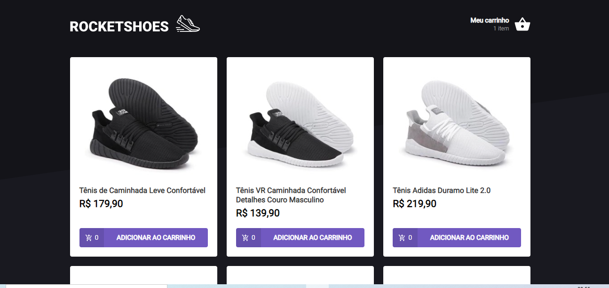
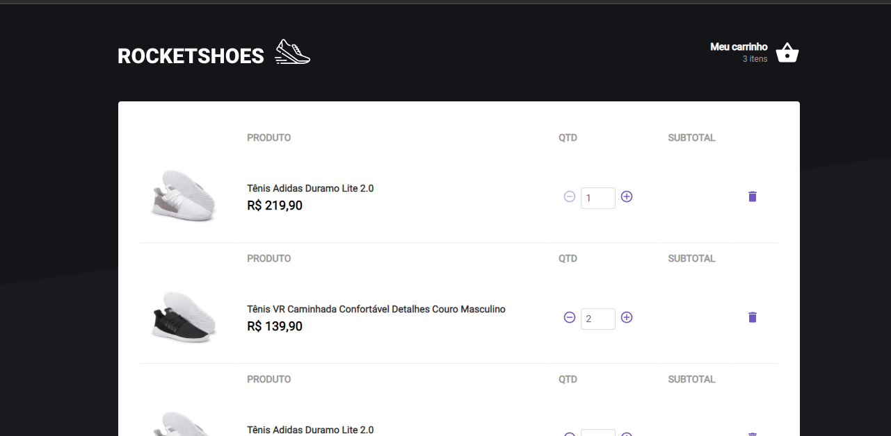

<h3 align="center">
  Desafio 03 - Criando um hook de carrinho de compras
</h3>

  
  
  

 

## Rocket: Sobre o desafio

Nesse desafio o principal objetivo é criar um hook de carrinho de compras. A aplicação tem duas páginas, um componente e um hook para implementar as funcionalidades pedidas nesse desafio:

- Adicionar um novo produto ao carrinho;
- Remover um produto do carrinho;
- Alterar a quantidade de um produto no carrinho;
- Cálculo dos preços sub-total e total do carrinho;
- Validação de estoque;
- Exibição de mensagens de erro;
- Entre outros.

### 🧪 Technologies

- React 
- TypeScript
- Fake API com JSON Server
- Yarn
- Axios
- React-Toastify
- Styled-components
- Polished

 

Esse projeto está sob a licença MIT. Veja o arquivo [LICENSE](/LICENSE) para mais detalhes.

---

Feito com :purple_heart: by [Thiago Carneiro](https://github.com/thiagofreitascarneiro)

 

© 2021 GitHub, Inc.
Terms
Privacy
Security
Status
Docs
Contact GitHub
Pricing
API
Training
Blog
About
